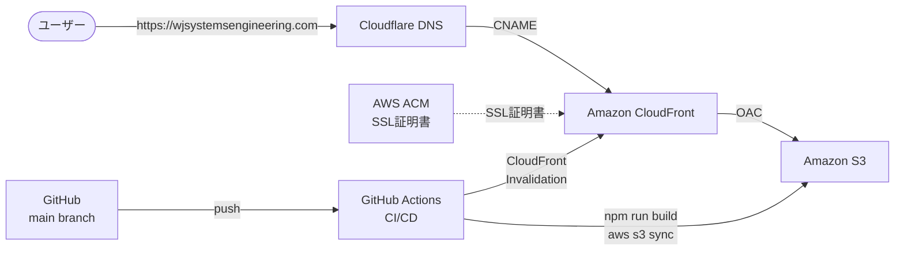

# WJSystemsEngineering Portfolio

個人事業主としてのポートフォリオサイトです。

🌐 **公開URL**: https://wjsystemsengineering.com

---

## 技術スタック

- **フロントエンド**: React / TypeScript / Tailwind CSS
- **ビルドツール**: Vite
- **UIライブラリ**: shadcn/ui / react-icons
- **アニメーション**: Motion

---

## インフラ構成



### 構成の概要

- **Cloudflare DNS**: ドメイン `wjsystemsengineering.com` のDNS管理。CloudFrontへCNAMEで転送。
- **Amazon CloudFront**: CDNとしてグローバルにコンテンツを配信。SSL終端もここで行う。
- **Amazon S3**: ビルド済みの静的ファイルを格納。CloudFrontからのみアクセス可能（OAC設定）。
- **AWS ACM**: SSL証明書を無料発行。バージニア北部リージョンで管理。
- **GitHub Actions**: mainブランチへのpushをトリガーに自動ビルド・デプロイ・キャッシュ削除を実行。

---

## ローカル開発

**前提条件**: Node.js

```bash
# 依存関係のインストール
npm install

# 開発サーバー起動
npm run dev
```

ブラウザで `http://localhost:5173` を開く。

---

## デプロイ

`main` ブランチにpushすると GitHub Actions が自動的に以下を実行します。

1. `npm run build` でビルド
2. `aws s3 sync` でS3にアップロード
3. CloudFrontのキャッシュを削除